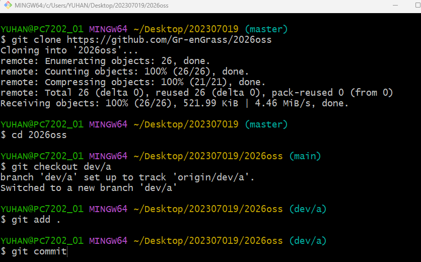
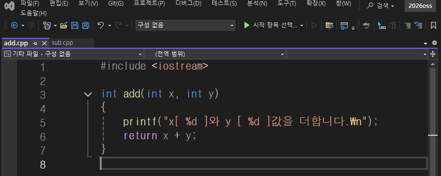
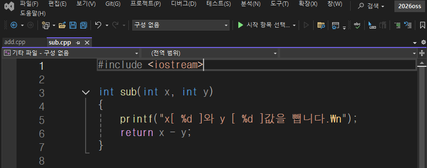
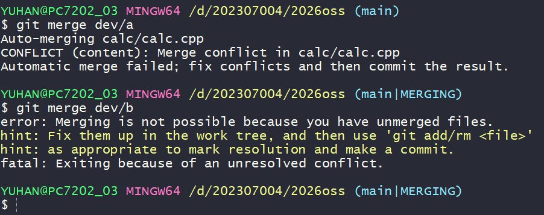
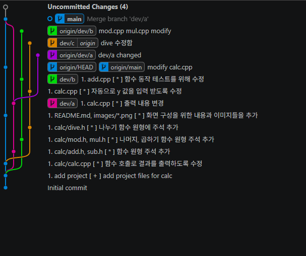

calc
2026oss 기말 프로젝트
저장소 : https://github.com/Gr-enGrass/2026oss

팀원
박민준 202307004 팀장 - main 브렌치 calc.cpp 수정
이종훈 202307019 팀원 - dev/b 브렌치 mul.cpp mod.cpp 수정
최은찬 202507015 팀원 - dev/a add.cpp 수정
차어진 202507012 팀원 - dev/c dive.cpp 수정

문제 해결 방법과 순서
1.main 브렌치와 dev/a병합 
2.main 브렌치와 dev/b브렌치 병합중 충돌 발생
3.충돌발 생한 dev/b내용 수정 하고 ff병합 완료
4.dev/c브렌치를 병합중에 충돌 발생
5.main브렌치의 내용을 수정하고 rebase 병합완료
6.결과 화면 캡처와 실행화면 캡처
7.readme.md 수정

중간과정 스크린샷
1.팀원들이 각자 코드를 수정

2. 병합중 오류 발생 

3. 코드수정

4.깃플로우

프로그램 실행 결과 